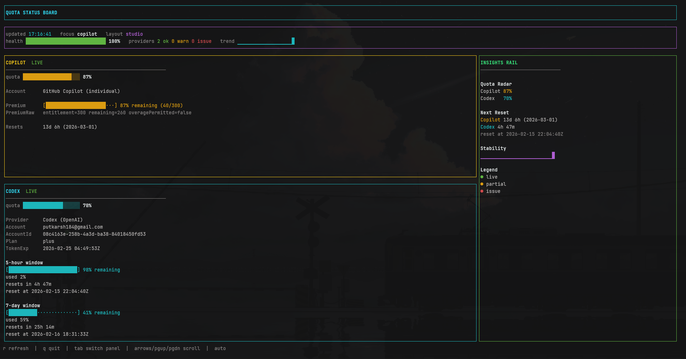

# agent-status

Fast Bun-based terminal UI for AI account/usage status.



Current providers:

- Codex/OpenAI via `~/.codex/auth.json` (fallback `~/.local/share/opencode/auth.json`)
- GitHub Copilot via `.copilot/config.json` (fallback to other known auth files)

## Features

- Queries all configured providers in parallel
- Displays plan/account/rate-window data in one TUI
- Keyboard controls: `r` refresh, `q` quit
- Auto-refresh every 60s (override with `AGENT_STATUS_REFRESH_MS`)
- `--once` mode for scripts/cron

## Run

```bash
bun run src/index.ts
```

Or:

```bash
bun run dev
```

## One-shot mode

```bash
bun run src/index.ts --once
```

## Install globally (local machine)

```bash
bun link
agent-status
```

## Build standalone binary

```bash
bun run build
./dist/agent-status
```

## Auth/env

Codex:

- Primary auth source: `~/.codex/auth.json`
- Fallback auth source: `~/.local/share/opencode/auth.json` (`openai`)
- Optional env override:
  - `OPENAI_ACCESS_TOKEN`
  - `OPENAI_ACCOUNT_ID`

Copilot:

- Primary OAuth source:
  - `~/.copilot/config.json` (`copilot_tokens`)
- Fallback OAuth discovery:
  - `~/.local/share/opencode/auth.json` (`github-copilot`)
  - `~/.config/opencode/auth.json`
  - `~/.opencode/auth.json`
- Optional env override:
  - `COPILOT_OAUTH_TOKEN`
- Optional billing API config:
  - `~/.config/opencode/copilot-quota-token.json`

Refresh interval:

- `AGENT_STATUS_REFRESH_MS` (minimum 5000)
